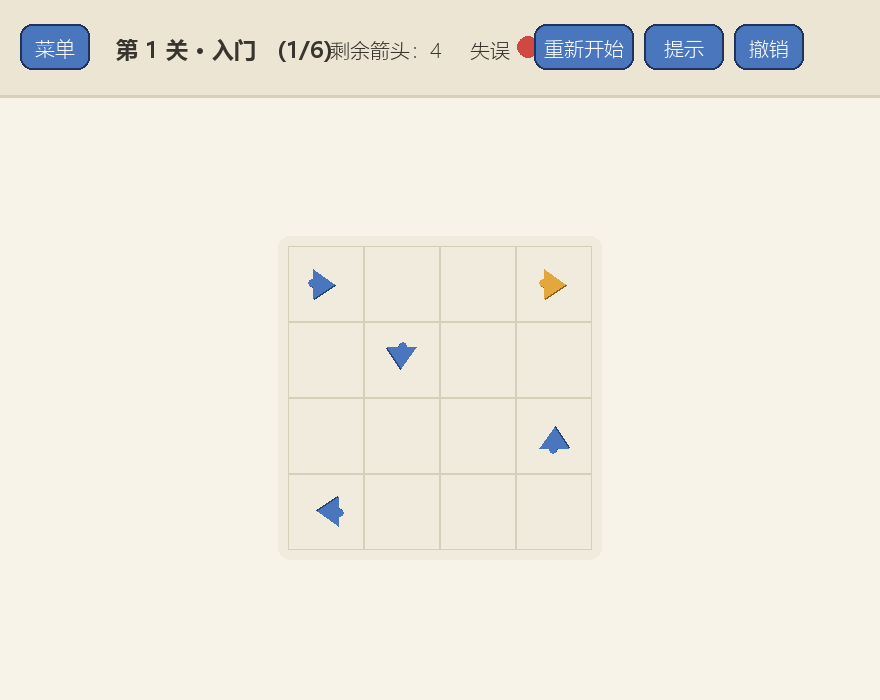
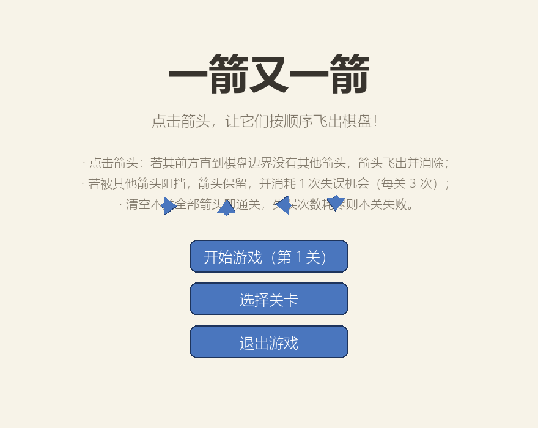
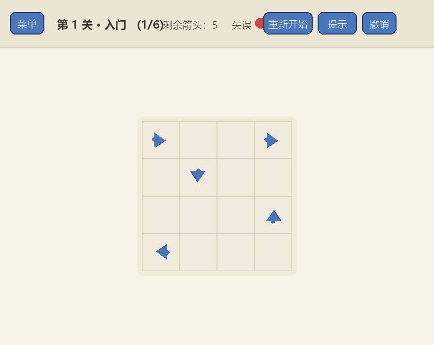
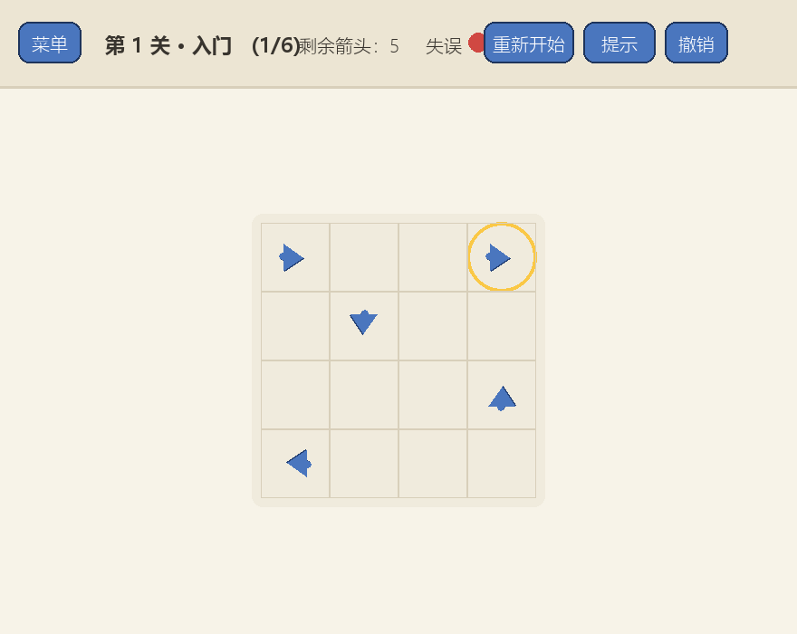
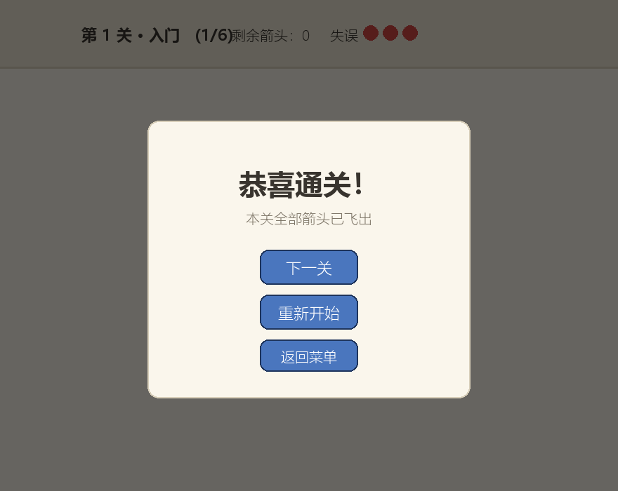
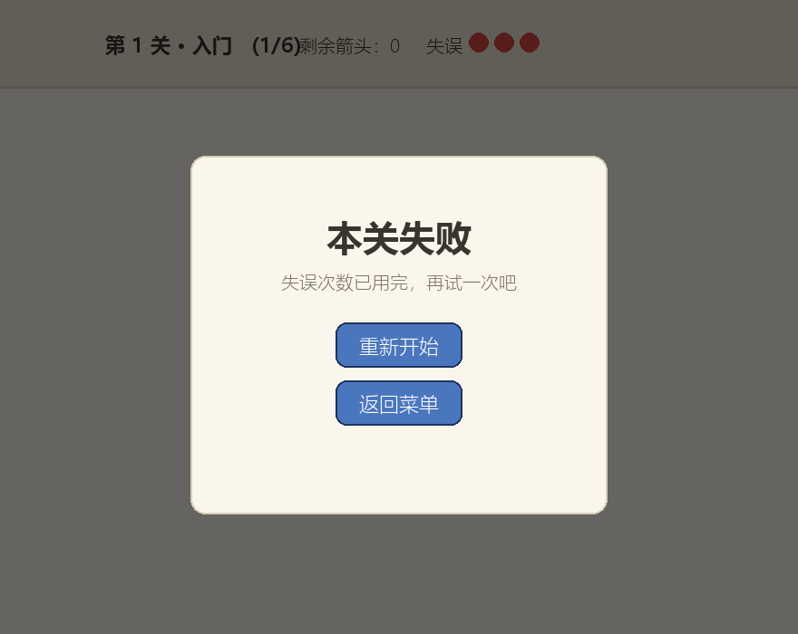
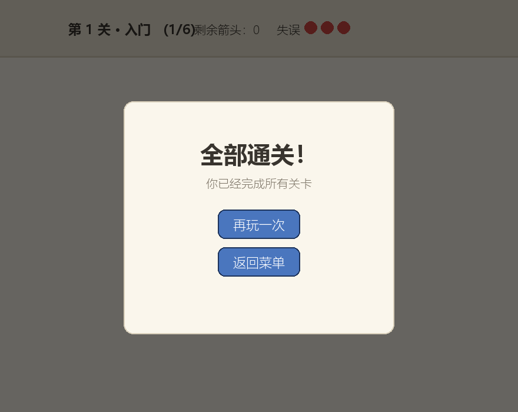

# 软件工程个人作业（第二次）：“一箭又一箭”小游戏开发博客

| 项目 | 内容 |
| --- | --- |
| 这个作业属于哪个课程 | 《软件工程》<课程链接：待填写> |
| 这个作业要求在哪里 | <作业链接：待填写> |
| 这个作业的目标 | 使用 Python 和 AIGC 完成“一箭又一箭”小游戏 |
| 学号 | 【待填写】 |
| GitHub 仓库 | <仓库链接：待填写> |

> 说明：本博客使用 **豆包（Doubao）AI 编程助手** 作为 AIGC 协作工具。文中所有 AIGC 协作记录均来自本次开发过程的真实记录（关键问题均有对应测试与提交可查证）。图片位于本地 `screenshots/` 目录，发布到博客平台时请将图片上传到博客图床并替换链接。

---

## 一、项目展示

演示 GIF（自动求解第 1 关，展示箭头依次飞出与通关界面）：



| 开始界面 | 游戏界面（第 1 关） | 提示高亮 |
| --- | --- | --- |
|  |  |  |

| 碰撞反馈 | 通关界面 | 失败界面 | 全部通关 |
| --- | --- | --- | --- |
|  |  |  |  |

## 二、项目介绍

### 2.1 游戏规则

棋盘上分布着朝上（`^`）、下（`v`）、左（`<`）、右（`>`）四个方向的箭头。玩家点击一个箭头后，程序检测其前进方向上的路径：

- 若箭头与棋盘边界之间**没有其他箭头**，箭头飞出棋盘并被消除；
- 若路径上**存在其他箭头**，箭头不能被消除，并通过晃动、变红和“前方有阻挡！”文字给出碰撞反馈，同时**消耗 1 次失误机会**；
- 每关有 3 次失误机会，**清空本关全部箭头即通关**并进入下一关；失误次数耗尽则本关失败，可重新开始。

路径判定采用网格单格箭头：只需判断同一行（左右箭头）或同一列（上下箭头）、箭头与边界之间是否还有其他箭头。

### 2.2 界面设计

- **开始界面**：标题、规则说明、开始游戏 / 选择关卡 / 退出三个按钮；
- **关卡选择界面**：6 个关卡按钮，显示关卡名与箭头数量；
- **游戏界面**：顶部信息栏显示当前关卡、剩余箭头数量、剩余失误次数（红色圆点），以及“菜单 / 重新开始 / 提示 / 撤销”按钮；中央为棋盘，支持悬停高亮；
- **通关 / 失败 / 全部通关界面**：半透明遮罩 + 结算弹窗与操作按钮。

配色采用暖纸色棋盘 + 蓝色箭头，箭头全部由代码绘制（多边形 + 旋转），不依赖任何图片素材。

### 2.3 主要功能与特色

基础功能全部实现：图形界面、四方向箭头、鼠标点击、路径阻挡判断、飞出消除、碰撞反馈、失误次数显示、3 个以上可通关关卡、通关/失败/重新开始流程。

扩展功能（附加分部分）：关卡选择、提示功能、撤销上一步、内置求解器（关卡可解性验证与提示依据）、飞出淡出动画、碰撞晃动动画、按钮悬停效果、快捷键（`R`/`H`/`Z`/`Esc`）。

## 三、实现思路

### 3.1 箭头、方向与关卡的表示

棋盘用**字符串列表**表示，每行等长，`.` 表示空格：

```python
# levels.py 中的关卡示例（第 1 关，4×4）
">..>",
".^..",
"...v",
"<...",
```

四个方向用方向向量表表示，路径检测时直接查表：

```python
DIRECTIONS = {
    '^': (-1, 0),   # 上
    'v': (1, 0),    # 下
    '<': (0, -1),   # 左
    '>': (0, 1),    # 右
}
```

`Board` 类维护 `rows × cols` 的二维网格，每个格子存放方向字符或 `None`；游戏状态（剩余箭头、失误次数、撤销栈、进行中/通关/失败）由 `Session` 类管理，`click(r, c)` 是点击的唯一入口，逻辑层与界面层完全解耦，因此可以脱离界面做单元测试。

### 3.2 路径检测（核心）

从箭头位置沿方向逐格前进，只要遇到其他箭头即被阻挡；走到棋盘边界则畅通：

```python
def can_fly(self, r, c):
    ch = self.arrow(r, c)
    if ch is None:
        return False
    dr, dc = DIRECTIONS[ch]
    nr, nc = r + dr, c + dc
    while self.in_bounds(nr, nc):       # 先判越界，再访问网格
        if self.grid[nr][nc] is not None:
            return False                # 路径上存在其他箭头，被阻挡
        nr += dr
        nc += dc
    return True                         # 到达边界，畅通无阻
```

两个关键点：

1. **“先判越界、后访问网格”**：`in_bounds` 保证即使箭头在棋盘边缘、方向指向棋盘外，循环也会立刻退出返回 `True`，不会发生数组越界（对应测试 T03）；
2. 方向统一查 `DIRECTIONS` 表，四个方向共用一套循环，而不是复制四份代码。

### 3.3 点击处理与失误机制

```python
def click(self, r, c):
    if self.status != 'playing':
        return 'none'
    ch = self.arrow(r, c)
    if ch is None:
        return 'none'
    if self.board.can_fly(r, c):
        self.board.grid[r][c] = None          # 飞出并消除
        self.undo_stack.append((r, c, ch))    # 供撤销使用
        if self.board.clear():
            self.status = 'won'
        return 'flew'
    self.mistakes_left -= 1                   # 被阻挡：失误 -1
    if self.mistakes_left <= 0:
        self.status = 'lost'
    return 'blocked'
```

界面层根据返回值播放**飞出动画**（箭头滑向棋盘外并淡出）或**碰撞反馈**（箭头左右晃动、变红 + “前方有阻挡！”浮动文字），视觉与逻辑分离。

### 3.4 关卡可解性验证（求解器）

这个游戏有一个重要性质：**删除箭头只会移除阻挡、不会新增阻挡**。因此只要每一步都存在至少一个可飞出箭头，任何删除顺序都能清空棋盘；反之，若某一步无箭头可飞而棋盘未清空，则本关不可解。

基于此实现贪心求解器，用于三件事：关卡设计时的合法性校验、游戏的“提示”功能、自动演示：

```python
def solve(self):
    order = []
    while not self.clear():
        cands = self.removable_arrows()
        if not cands:
            return None            # 存在互堵死锁，不可解
        r, c = cands[0]
        self.grid[r][c] = None
        order.append((r, c))
    return order
```

### 3.5 关卡设计原则

设计关卡时发现并总结出两类**互堵死锁**结构，必须避免：

- 同一行中“`>` 在 `<` 左侧”且中间无其他箭头：两者互相阻挡，永远无法移除；
- 同一列中“`v` 在 `^` 上方”：同样互相阻挡。

初版第 2、3、4、6 关都出现过这类死锁（详见 AIGC 使用过程记录），被求解器测试发现后逐一人工调整。

## 四、AIGC 使用过程

本作业使用 **豆包（Doubao）AI 编程助手** 辅助开发。以下是 4 次具有代表性的协作过程：

| 子任务 | 借助何种 AIGC 技术 | AI 实现或提供了什么 | 效果如何 | 人工修改 |
| --- | --- | --- | --- | --- |
| 路径检测 | 豆包 | 生成四方向路径检测代码与方向向量表 | 初版 `'^'` 方向向量写错（误配为向下），顶边朝上箭头被误判为阻挡 | 用 T03 边界用例暴露后，修正方向向量为 `(-1, 0)` |
| 关卡设计 | 豆包 | 生成关卡数组与死锁检测思路 | 第 2、3、4、6 关初版存在同行/同列互堵死锁，无法通关 | 用求解器逐一验证，调整箭头方向消除死锁并重新试玩 |
| 碰撞/飞出动画 | 豆包 | 补全箭头晃动、变色与淡出动画代码 | 初版把箭头尺寸写成浮点数导致绘制报错，晃动频率偏高 | 修复整数类型转换，调整晃动幅度与动画时长 |
| 自动化测试 | 豆包 | 生成 T01~T06 测试用例与 UI 冒烟测试 | 逻辑测试全部通过 | 补充了互堵关卡检测、边缘用例，修正了 1 处测试自身的棋盘设计错误 |

### 记录 1：四方向路径检测（边界条件修复）

**提出的要求**：实现“箭头沿前进方向到棋盘边界之间没有其他箭头即可飞出”的检测，四个方向都要支持，且边缘朝外的箭头不能越界。

**AI 完成的工作**：给出 `DIRECTIONS` 方向向量表与基于 `while` 循环的逐格检测代码，结构清晰。

**实际效果与问题**：初版代码中 `'^'`（上）的方向向量被写成了 `(1, 0)`（向下），导致顶边朝上的箭头会被错误地检查下方路径。我在自动化测试里加入了“顶边朝上的箭头应能飞出”的边界用例（T03），测试立即失败暴露了该问题。

**人工修改**：将 `'^'` 的向量修正为 `(-1, 0)` 后测试通过。这让我意识到：**AI 生成的代码必须用边界用例验证，尤其方向、索引这类容易“差一点”的逻辑**。对应提交：`fix: 修正向上箭头的方向向量，通过 T03 边界用例`。

### 记录 2：关卡设计（不可解布局的发现与调整）

**提出的要求**：设计若干难度递增、且保证存在通关顺序的关卡。

**AI 完成的工作**：生成了多组关卡数组，并提示可以用贪心求解器验证可解性。

**实际效果与问题**：把初版关卡交给求解器测试后，第 2、3、4、6 关均被判定“不可解”。分析发现是两类**互堵死锁**：如第 3 关初版同一行 `>...<` 两箭头互相阻挡；第 4 关同一列 `v` 在上、`^` 在下互相阻挡。这类布局即使先删除其他箭头也无法解除（两箭头互相构成对方的阻挡）。

**人工修改**：根据求解器输出逐个调整死锁处箭头方向（如将 `<` 改为空格、将 `v` 改为空格），每次修改后重新运行求解器测试，直到 6 关全部验证可解，并逐关试玩确认通关顺序合理。这个过程让我真正理解了“可解性”的本质，也体会到**自动验证比肉眼检查可靠得多**。对应提交：`fix: 调整第 2/3/4/6 关布局，消除互堵死锁并通过求解器验证`。

### 记录 3：碰撞与飞出动画（参数与类型问题）

**提出的要求**：箭头成功飞出时要有滑出+淡出动画，被阻挡时要有晃动+变色+文字提示。

**AI 完成的工作**：生成了 `FlyOut`（沿方向移动到棋盘外一格并逐渐透明）与 `Shake`（正弦波左右晃动并变红）两个动画类，以及浮动提示文字类。

**实际效果与问题**：初版运行时出现 `TypeError: 'float' object cannot be interpreted as an integer`——箭头绘制尺寸写成了 `CELL * 0.55` 这种浮点数，直接传给 `pygame.draw` 的 `border_radius` 报错；另外初版晃动频率偏高、幅度衰减不明显，视觉上过于“抖”。

**人工修改**：在绘制函数入口将尺寸转为整数；把晃动频率从 `48` 调到 `42`、幅度加上 `(1 - k)` 衰减因子，让动画先剧烈后平息；同时把飞出动画时长控制在约 0.34s。调整后动画反馈清晰、不喧宾夺主。

### 记录 4：自动化测试（T01~T06）

**提出的要求**：按作业要求编写 T01~T06 六项测试，并补充关卡合法性检查。

**AI 完成的工作**：生成了基于 `unittest` 的测试文件，覆盖“无阻挡飞出 / 有阻挡失误 -1 / 边缘不越界 / 清空通关 / 失误耗尽失败 / 进行中重开恢复”六类场景，以及全部关卡的可解性校验。

**实际效果与问题**：T01~T05 直接通过；T06 测试自身初版选错了棋盘（选了一个本身互堵、没有任何箭头可飞的棋盘），导致断言失败。

**人工修改**：重新设计 T06 的棋盘（`.<>..>`：一个可飞出、一个被阻挡），并额外补充了“互堵关卡应被判定为不可解”的反例测试和 UI 冒烟测试（虚拟显示驱动下绘制所有界面、跑通通关与失败流程）。最终 **19 项测试全部通过**。

## 五、测试结果

测试环境：Windows + Python 3.14.7 + pygame-ce 2.5.8，运行命令：

```bash
python -m unittest discover -s tests -v
```

| 编号 | 测试内容 | 预期结果 | 实际结果 | 是否通过 |
| --- | --- | --- | --- | --- |
| T01 | 点击前方无阻挡的箭头 | 箭头飞出棋盘并消失 | 箭头消失，剩余数量减少 | ✅ 通过 |
| T02 | 点击前方有阻挡的箭头 | 箭头不消失，失误次数减 1 | 箭头保留，失误 3→2 | ✅ 通过 |
| T03 | 点击位于边缘且朝向棋盘外的箭头 | 箭头正常消失，不发生越界错误 | 上/下/左/右及角上箭头均正常飞出 | ✅ 通过 |
| T04 | 消除本关全部箭头 | 显示通关并进入下一关 | 状态变为 won，自动切换到通关界面，可进入下一关 | ✅ 通过 |
| T05 | 失误次数耗尽 | 显示失败并允许重新开始 | 状态变为 lost，重新开始后棋盘与失误恢复 | ✅ 通过 |
| T06 | 游戏进行中重新开始 | 箭头布局和失误次数恢复 | 布局、失误次数、撤销栈均恢复初始 | ✅ 通过 |
| 附加 | 全部 6 关可解性验证 | 每关都存在通关顺序 | 求解器验证全部可解 | ✅ 通过 |
| 附加 | 互堵关卡检测 | 不可解布局能被识别 | 死锁关卡被判定为不可解 | ✅ 通过 |
| 附加 | UI 冒烟测试 | 各界面可绘制、流程正常 | 全部界面绘制与流程切换无异常 | ✅ 通过 |

**测试小结**：共 19 项测试全部通过。测试不仅验证了需求，还真实暴露了开发中的 3 个 Bug（方向向量错误、关卡死锁、动画类型错误），体现了“先写用例、再验证”的价值。除自动化测试外，6 个关卡均已人工试玩，确认存在合理的通关顺序。

## 六、PSP 表格

| 任务 | 预估耗时（小时） | 实际耗时（小时） | 差异（小时） |
| --- | ---: | ---: | ---: |
| 需求分析与游戏设计 | 1.0 | 0.5 | -0.5 |
| Python 与图形库学习 | 2.0 | 1.5 | -0.5 |
| 游戏界面实现 | 4.0 | 3.0 | -1.0 |
| 路径与碰撞逻辑实现 | 3.0 | 2.0 | -1.0 |
| 关卡设计 | 2.0 | 2.5 | +0.5 |
| AIGC 辅助开发 | 2.0 | 1.5 | -0.5 |
| 测试与修改 | 2.0 | 2.0 | 0.0 |
| README 与博客撰写 | 3.0 | 3.5 | +0.5 |
| **合计** | **19.0** | **16.5** | **-2.5** |

> 实际耗时为本次开发记录值，请按个人实际情况核对调整。

## 七、心得体会

**AI 带来的帮助**：AIGC 把“从零搭框架”变成了“在草稿上修改”。路径检测、动画类、测试用例这些成熟模式，AI 能一次性给出可用版本，让我把精力集中在真正需要判断的地方——边界条件、关卡可解性、交互细节。特别是“先用测试暴露问题、再让 AI 和人工一起修”的工作方式，开发效率明显提高。

**出现的问题**：AI 生成代码最大的风险是“看起来对、实际错”。本次 AI 的路径检测方向向量写错、关卡出现互堵死锁、动画参数类型错误，都是只靠肉眼检查发现不了的，全部要靠边界用例和求解器这类**可验证的手段**兜底。这提醒我：AI 是“高效的草稿生成器”，不是“可靠的代码评审员”，把 AI 代码直接当正确答案是最危险的用法。

**我的收获**：一是真正理解了本游戏路径检测与“互堵死锁”的本质（同行 `>` 对 `<`、同列 `v` 对 `^` 必然无解），并会用贪心求解器证明关卡可解；二是掌握了“逻辑层与界面层解耦 + 自动化测试”的工程习惯，使逻辑可以脱离图形界面被反复验证；三是对 AI 协作有了更理性的定位——提问要具体（“请实现四方向路径检测并处理边缘越界”），验证要独立（测试、试玩、求解器），修改要敢下手。

## 附：运行环境与提交信息

- 运行：`pip install -r requirements.txt` 后执行 `python main.py`；
- 测试：`python -m unittest discover -s tests -v`；
- Git 提交遵循 `feat: / fix: / test: / docs:` 规范分阶段提交，关键修复（方向向量、关卡死锁）均有对应提交可追溯。
